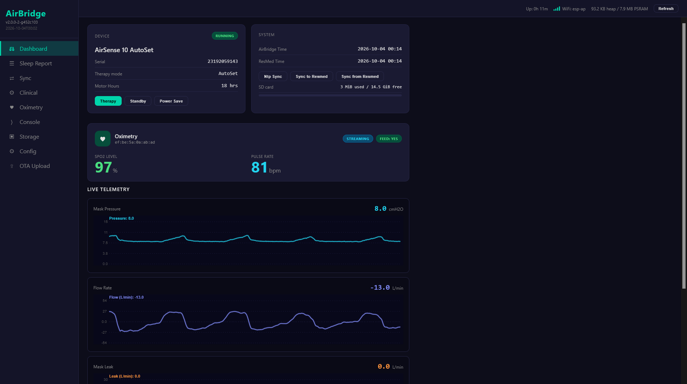
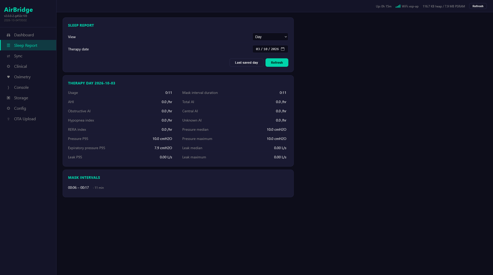
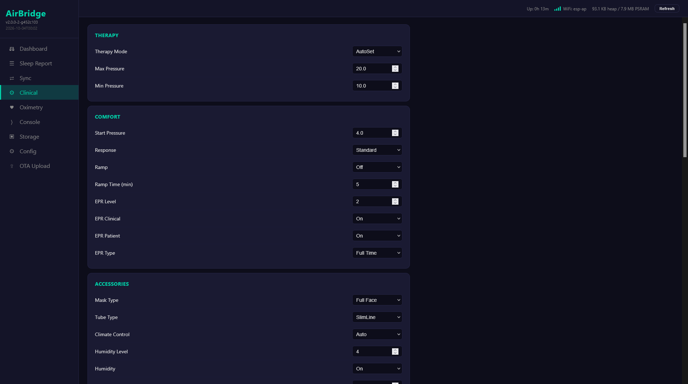
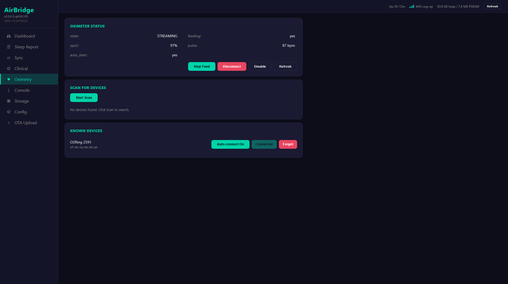
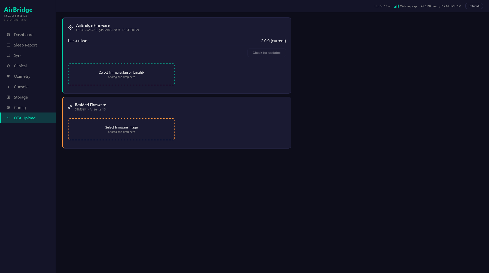

# AirBridge

ESP32 bridge for ResMed AirSense 10 CPAP.

## What it does

- **Web UI** - configure therapy settings, view sleep reports, live pressure/flow waveforms, and manage oximeters.
- **SD recording and export** - records therapy in Air10 EDF format and synchronizes files to SMB and SleepHQ on [SD-capable hardware](docs/hardware.md#what-needs-sd).
- **Oximetry** - feeds SpO2/pulse into AirSense for native SAD.edf recording. BLE (Nonin 3150, O2Ring, O2Ring-S, Checkme O2, WS20A, generic PLX/HR sensors) and UDP for integrating unsupported devices.
- **ResMed OTA** - upload and flash AirSense firmware over WiFi.
- **TCP-UART bridge** - send commands to AirSense over WiFi.

## First setup

Follow the [Quick Start](docs/quickstart.md) to wire and flash your board.
On a fresh installation, connect to its `airbridge_...` WiFi network
(password `airbridge`), open `http://192.168.4.1/`, and complete the setup wizard.
Default Web UI login: `admin` / `airbridge`.

## Related tools

[airbreak-plus](https://github.com/m-kozlowski/airbreak-plus/tree/master/python/) contains Python tools for direct serial/TCP interaction:

- `python/resmed_flash.py -p tcp:airbridge` - flash AirSense firmware
- `python/resmed_config.py -p tcp:airbridge` - read/write AirSense settings

Both support serial (`-p /dev/ttyUSB0`) and TCP (`-p tcp:hostname`) with `--tcp-mode=raw|transparent|text`.

## Screenshots

| Dashboard | Sleep Report |
|---|---|
|  |  |

| Clinical Settings | Oximetry | OTA Upload |
|---|---|---|
|  |  |  |

## License

GPL v3. See [LICENSE](LICENSE).
