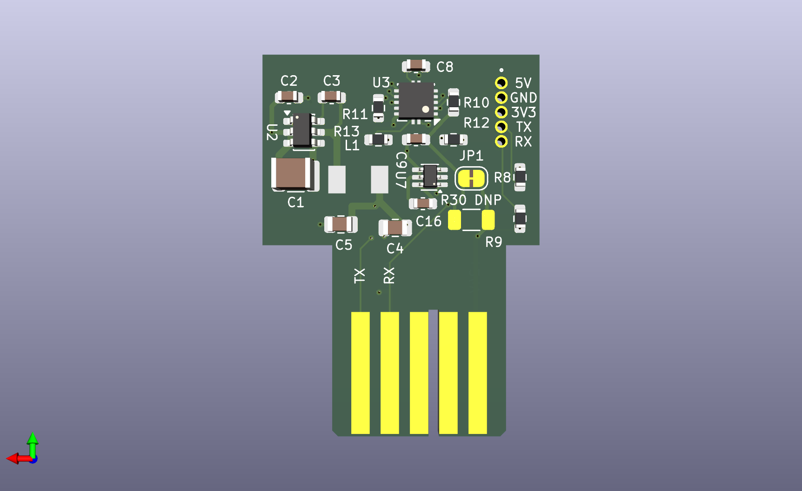
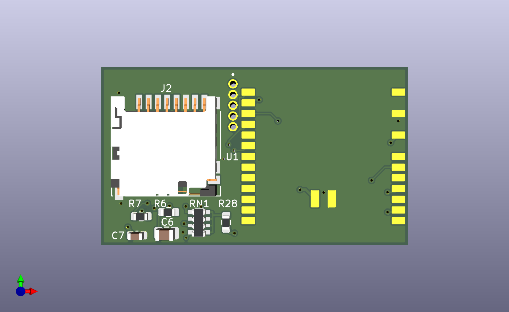
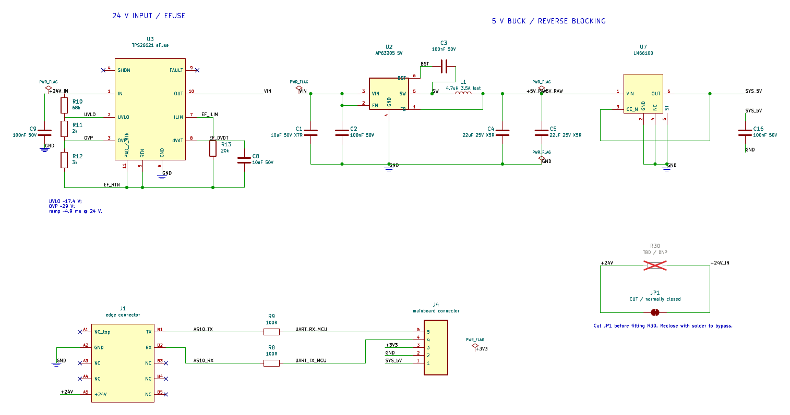
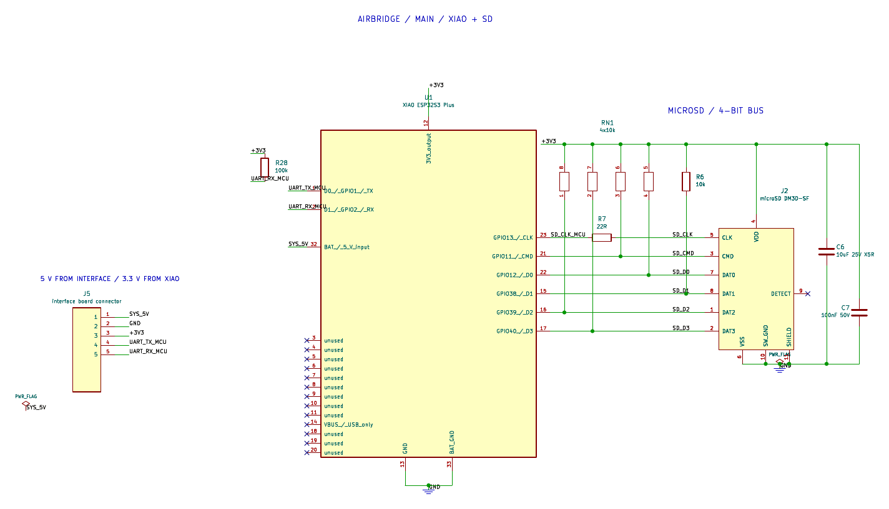

# PCB

Two boards:

- **interface**: edge card that plugs into the AirSense 10. Protected 24 V
  input, 5 V buck, UART.
- **main**: XIAO ESP32-S3 Plus and 4-bit microSD.

The boards are joined by a 5-pin, 1.27 mm solder-pin connector.
Build env: `xiao-esp32s3-plus-sdmmc4`. GPIO and SD features:
[hardware.md](hardware.md).

| Interface | Main |
|-----------|------|
|  |  |

## Interface board

[KiCad project](../hardware/pcb/board_interface/),
PDF: [board_interface.pdf](../hardware/schematics/board_interface.pdf).

### Power

- **TPS26621 eFuse** on +24 V: UVLO ~17.4 V, OVP ~29 V, dV/dt soft-start
  ~4.9 ms at 24 V. The soft-start replaces the series resistor used in
  hand-wired builds, so hot-plugging does not trip the AirSense.
- **AP63205** 5 V buck.
- **LM66100** ideal diode between the buck and `SYS_5V`. It does the job of the
  Schottky in hand-wired builds, without the drop.

R30 (1206, not fitted) is an optional series resistor on +24 V, bypassed by
the JP1 solder jumper. Cut JP1 before fitting R30; bridge it with solder to
go back.

### UART

AirSense TX/RX go through 100 Ω series resistors to the interboard connector.

### Interboard connector

| Pin | Signal |
|-----|--------|
| 1 | SYS_5V |
| 2 | GND |
| 3 | +3V3 |
| 4 | UART_TX_MCU (to AirSense RX) |
| 5 | UART_RX_MCU (from AirSense TX) |

## Main board

[KiCad project](../hardware/pcb/board_main_xiao/),
PDF: [board_main_xiao.pdf](../hardware/schematics/board_main_xiao.pdf).

- XIAO ESP32-S3 Plus soldered onto pads; `SYS_5V` feeds its BAT input (see
  [hardware.md](hardware.md#xiao-through-bat)).
- Hirose DM3D-SF microSD socket powered from XIAO 3V3.
- 10 kΩ pull-ups on CMD and D0–D3, 22 Ω series resistor on CLK, 10 µF +
  100 nF at the socket.
- 100 kΩ pull-up on UART RX.

## Ordering

Both boards: 4 layers, 1.6 mm. Tinned (HASL) edge fingers are good enough.

| Board | Gerbers | BOM | CPL |
|-------|---------|-----|-----|
| interface | [interface.zip](../hardware/pcb/gerbers/interface.zip) | [bom-interface.csv](../hardware/pcb/assembly/bom-interface.csv) | [cpl-interface.csv](../hardware/pcb/assembly/cpl-interface.csv) |
| main | [main_xiao.zip](../hardware/pcb/gerbers/main_xiao.zip) | [bom-main-xiao.csv](../hardware/pcb/assembly/bom-main-xiao.csv) | [cpl-main-xiao.csv](../hardware/pcb/assembly/cpl-main-xiao.csv) |

BOM/CPL are in JLCPCB format with LCSC part numbers. Not included: the XIAO
module and the interboard pins, both soldered by hand.

Enclosure: [airbridge-xiao.stl](../hardware/enclosure/xiao/airbridge-xiao.stl).
