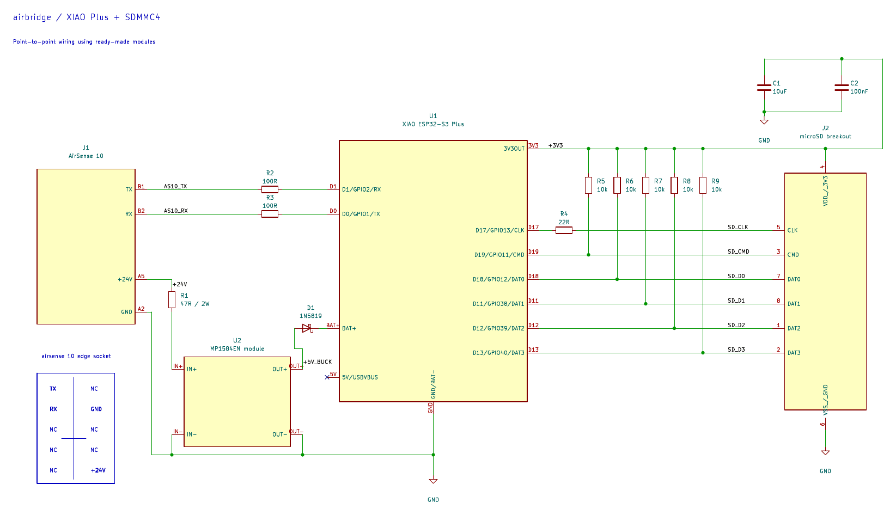
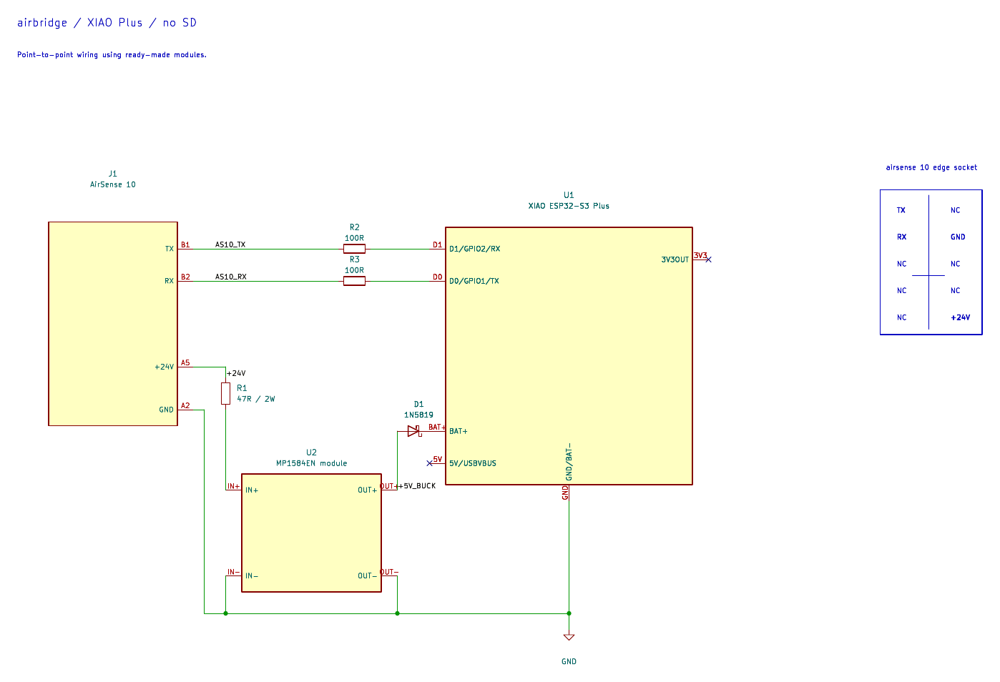
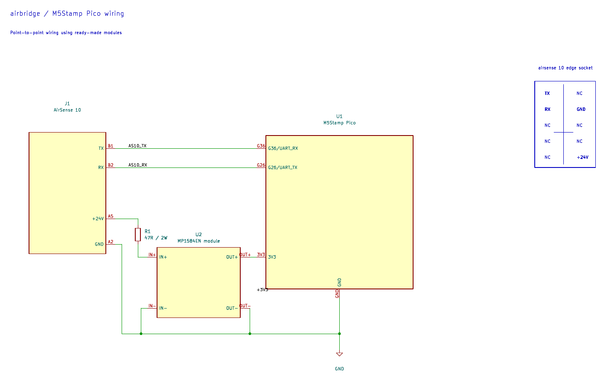

# Hand-wired hardware

Point-to-point wiring with ready-made modules. For the pinout, SD features and
power rationale see [hardware.md](hardware.md).

Each variant has a KiCad 9 project with its local symbol library and a PDF.
Module symbols show solder-pad names, not IC pin numbers.

## XIAO ESP32-S3 Plus + SD

Build env: `xiao-esp32s3-plus-sdmmc4`.
KiCad: [xiao_sd.kicad_pro](../hardware/wiring/xiao_sd/xiao_sd.kicad_pro),
PDF: [wiring_xiao_sd.pdf](../hardware/schematics/wiring_xiao_sd.pdf).

Parts:

- Seeed XIAO ESP32-S3 Plus
- MP1584EN buck module
- 1N5819 Schottky diode
- 47 Ω / 2 W resistor
- 2× 100 Ω (UART)
- passive 3.3 V microSD breakout exposing all eight contacts
- 5× 10 kΩ, 22 Ω, 10 µF, 100 nF (SD)

Power:

- set the buck to **5.0 V before connecting the diode**
- diode cathode (band) to **BAT+**
- leave the **5V** pad unconnected

SD:

- the breakout must be passive and bring out DAT1 and DAT2. Six-pin SPI
  modules (with level shifter/regulator) do not work.
- pull-ups on CMD and DAT0–DAT3, 22 Ω in series with CLK, decoupling at the
  socket.
- keep SD wires short. With long leads build with `AB_SDMMC_FREQ_KHZ=20000`.

## XIAO ESP32-S3 Plus without SD

Build env: `xiao-esp32s3-plus`.
KiCad: [xiao.kicad_pro](../hardware/wiring/xiao/xiao.kicad_pro),
PDF: [wiring_xiao_no-sd.pdf](../hardware/schematics/wiring_xiao_no-sd.pdf).

Same as above without the SD part.

## M5Stamp Pico (legacy)

Build env: `m5stamp-pico`.
KiCad: [pico.kicad_pro](../hardware/wiring/pico/pico.kicad_pro),
PDF: [wiring_pico.pdf](../hardware/schematics/wiring_pico.pdf).

MP1584EN set to **3.3 V**, output straight to the Pico 3V3 pin. 47 Ω / 2 W
in series with +24 V. Any 24 V to 3.3 V buck able to supply 300 mA+ will do.
